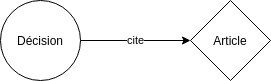
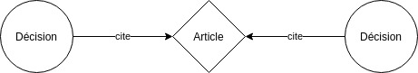
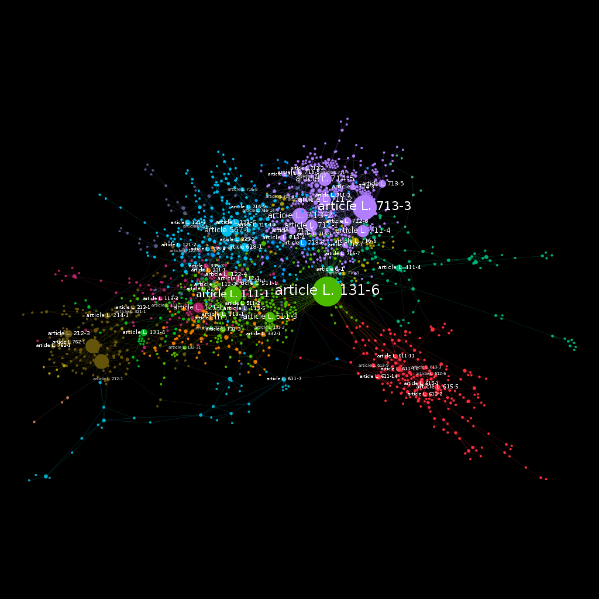
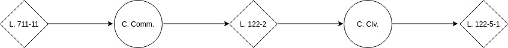

Version intéractive : https://hotsnown.github.io/citation-graph/
 
# Visualiser le Droit de la Propriété Intellectuelle

## Les Mathématiques du Droit

Vous l'avez peut-être remarqué : sous l'impulsion du numérique, tout devient de plus en plus «visuel». Les textes ont tendance à être massivement remplacés par des vidéos, des dessins ou des schémas. Les sites Web et les réseaux sociaux regorgent d'images, à une époque où la vitesse est désormais un élément essentiel de la vie quotidienne et où les individus consacrent moins d'une minute de leur concentration à un texte.

De même, lors de mes études en Droit, ma façon préférée de réviser était de traduire visuellement mes cours dans des cartes mentales dont certaines se sont étendues sur des dizaines de pages. Lorsque j’étais confronté à une question de droit, mon premier réflexe était de situer le problème dans ma carte. Ensuite, j’essayais de faire une analyse spatiale en regardant les éléments voisins et lointains, les parents et les enfants, les éléments centraux et périphériques…

Malheureusement, cette technique connaît des limites. La jurisprudence judiciaire est alimentée chaque année par plus de 2,5 millions de décisions. La quantité de ces mégadonnées rend impossible la création manuelle d’une synthèse du droit positif.

C’est ainsi que je propose aujourd’hui d’introduire une représentation automatisée et spatiale du Droit : nous allons essayer de visualiser le Droit de la Propriété Intellectuelle sous la forme d’un réseau.

## Comprendre le réseau

Notre réseau est défini par un ensemble d'éléments : les articles du CPI et les décisions qui citent au moins un article du CPI. 

Ces éléments sont représentés graphiquement par des cercles qui sont éventuellement reliés par une ligne lorsqu’un arrêt cite un article.

Le fait que deux arrêts citent le même article conduit à former une relation indirecte entre les deux arrêts.

En étendant cette logique, on parvient à relier l’intégralité des articles du Code de la propriété intellectuelle.

## Quelques chiffres

**Collecte des données.** Les décisions ont été collectées à partir de trois bases de données (INCA/CASS/CAPP) mise à disposition par data.gouv.fr, dont la somme totale nette s'élève à 500 000 décisions. Après avoir supprimé les décisions dupliquées, vides et ambiguës, le corpus nettoyé a été à approximativement 450 000 décisions. Finalement, le corpus a été limité aux litiges en Propriété Intellectuelle, diminuant ainsi le fonds à 1015 décisions.

**Traitement des données.** Après avoir collecté les données, le réseau a été construit à l’aide de la populaire bibliothèque networkx. Il en est résulté un graphe comportant 1674 noeuds (dont 659 articles et 1015 décisions) et 2958 liens.

**Visualisation des données.** Maintenant qu’une une représentation abstraite du réseau est disponible, il est nécessaire de le matérialiser. Cette étape est loin d’être triviale et suppose de faire des choix quant à la disposition ou au style des noeuds (entre autres). Par exemple, il a été choisi de créer une relation linéaire entre la taille d’un noeud du graphe et son nombre de connexions. 

Représentation visuelle de la construction du layout du graphe disponible ci-joint

## Le Monde (de la PI) est Petit

“*The purpose of visualization is insight, not pictures.*”
―Ben Shneiderman

Je vous propose de jouer à un jeu. Il se joue, après avoir choisi deux articles aléatoires, en voyant s’il est possible de connecter le premier avec le second dans notre graphe. Une connexion est établie si les deux articles sont citées dans la même décision. L'objectif est de connecter les deux articles avec six connexions ou moins.

Par exemple, si l’on choisit les articles L.711-1 et L122-5 du CPI après tirage au sort, il semblerait difficile de trouver un lien entre les deux articles. Le premier définit les conditions de validité d’une marque tandis que le second prévoit (entre autres) une exception familiale à l’action en contrefaçon. Il apparaît cependant qu’il est possible de tracer un chemin.

Dans l’ordre :
- *L. 711-1 du CPI*
- *Cour de cassation, civile, Chambre commerciale, 6 mai 2014, 11-22.108, Inédit*
- *L. 122-2 du CPI*
- *Cour de cassation, civile, Chambre civile 1, 14 janvier 2010, 08-16.024, Inédit*
- *L. 122-5-1 du CPI*

Le premier arrêt est une action en contrefaçon où l’article L. 122-2 est invoqué dans les moyens du demandeur pour arguer que la présentation accessoire d’un produit protégé par une marque ne caractérise pas la condition de communication requise par l’action en contrefaçon, tandis que l’article L. 711-1 est invoqué pour demander la nullité de la marque pour absence de distinctivité.

Dans le second arrêt, un hôtelier installe des postes de télévisions qui permettent d’écouter de la musique. L’article L. 122-2 est utilisé pour critiquer le fait qu’il y a communication au public dans la mesure où les clients d’un hôtel consomme le contenu dans leur chambre privée. L’article L 122-5-1 est utilisé pour définir la notion de public a contrario : il peut y avoir un public sans la réunion de plusieurs personnes car cette notion est définie par l’absence de caractère familial.

C’est ainsi qu’il est possible de relier, en deux connexions, deux articles conceptuellement très éloignés. Mieux encore, la moyenne du nombre minimal de décisions nécessaires pour connecter deux articles aléatoires dans notre réseau est d’approximativement 4. 

On peut tirer de cette expérience l’information selon laquelle le Droit de la PI, malgré sa summa divisio (Propriété Artistique / Propriété Industrielle), est un système interconnecté. Une analyse visuelle du réseau révèle l’existence d’articles centraux (L. 111-1, L. 511-1, L. 711-1) qui sont cités par toutes les branches de la PI. Cette centralité est expliquée par le caractère fondamental de ces articles qui définissent respectivement les caractères essentiels du Droit d’auteur, des Marques et des Brevets. Concrètement, ces articles sont régulièrements utilisés, dans une demande incidente, lorsqu’une partie cherche à utiliser des dispositions, provenant d’une branche de la PI, externes à l’objet du litige car ils synthétisent “l’essence” des branches sus-visées.

Nous avons vu comment la représentation d’articles et de décisions sous forme d’un réseau permet d’inférer des propriétés d’un système juridique. De façon générale, représenter graphiquement le Droit, c’est recourir à des procédés (infographie, graphe, tableur, graphique, carte) qui le synthétise, l’allège, et le simplifie. L’intérêt fondamental de ces techniques, structurées par les disciplines de la Data Visualization et du Legal Design, est de nous apprendre que l’essence du Droit n’est pas limité à une succession de textes.
